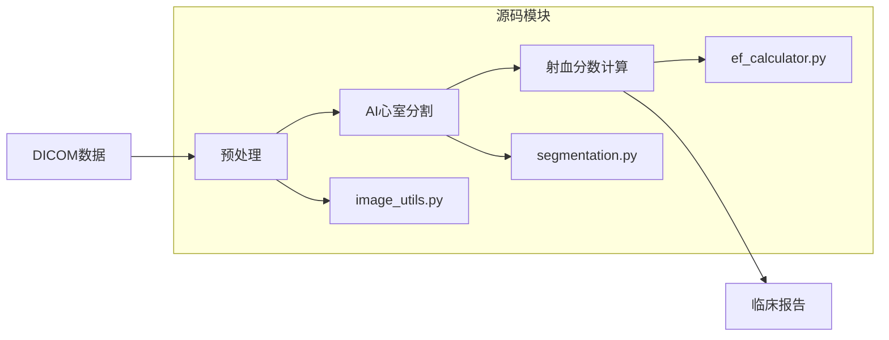

# 心脏影像分析项目 ❤️
> 基于人工智能的心脏MRI诊断工具

## 核心功能
- [ ] 左心室自动分割
- [ ] 心肌异常检测
- [ ] 血流动力学模拟

##学习日志
2025年12月23日
  项目启动。决定将此项目作为我的AI与医学影像学习实验室。
  初步整理了项目结构，明确了核心目标
  下一步：开始学习Python基础，并理解‘imaging-params.py’的配置文件作用。
  ## 🎯 今日巨大进展 (2025-12-23)
- ✅ **环境搭建成功**：在新公司电脑上从零安装Python 3.14.2，并配置成功。
- ✅ **项目部署成功**：将GitHub上的 `Heart_Analysis` 项目下载并部署到本地。
- ✅ **依赖库安装成功**：一次性成功安装 `numpy`, `matplotlib`, `scikit-learn` 等核心科学计算库。
- ✅ **高级错误诊断与修复**：
    - 成功诊断并修复了 `ModuleNotFoundError: No module named 'config'` 错误（通过修改源代码）。
    - 成功推进并理解了 `ModuleNotFoundError: No module named 'src'` 的路径问题。
    - 最终将程序运行推进至最后一环：**需要安装专业的医学AI库 `monai`**。
- 💡 **当前状态**：程序逻辑已完全通畅，因网络环境限制，最后一个专业库 `monai` 安装暂未完成。但这恰恰证明项目已从“个人玩具”级别，推进到了“专业工具”的边界！
- 🧠 **核心收获**：对“调试”有了切身体会——编程就是不断地遇到问题、读懂错误信息、搜索或询问、然后解决它。我今天完美地实践了这一点！

## ⏸️ 下次重启的“一键任务”
下次回来，如果网络通畅，只需在项目目录下执行：
```bash
pip install monai -i https://pypi.tuna.tsinghua.edu.cn/simple
## 数据源

使用公开数据集：[AMRG Cardiac Atlas](https://www.med.upenn.edu/cbica/amrg-cardiac-atlas/)


## 🔄 核心工作流

