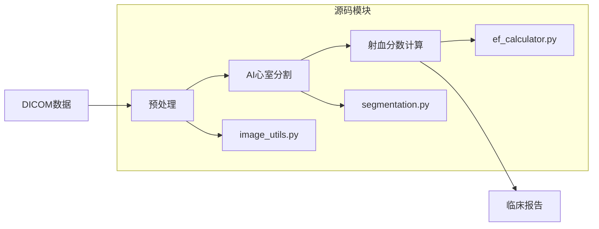

# 心脏影像分析项目 ❤️
> 基于人工智能的心脏MRI诊断工具

## 核心功能
- [ ] 左心室自动分割
- [ ] 心肌异常检测
- [ ] 血流动力学模拟

## 数据源

使用公开数据集：[AMRG Cardiac Atlas](https://www.med.upenn.edu/cbica/amrg-cardiac-atlas/)

## 🔄 核心工作流

```mermaid
graph LR
D[DICOM数据] --> P[预处理]
P --> M[AI心室分割]
M --> C[射血分数计算]
C --> R[临床报告]

subgraph 源码模块
    P --> image_utils.py
    M --> segmentation.py
    C --> ef_calculator.py
end
```
